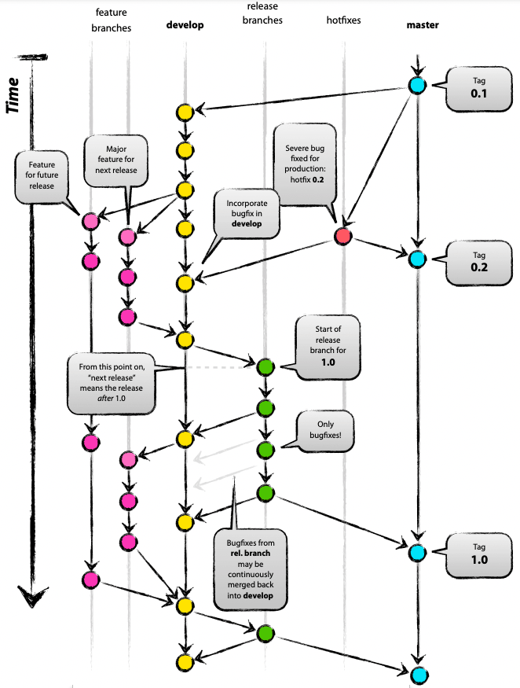
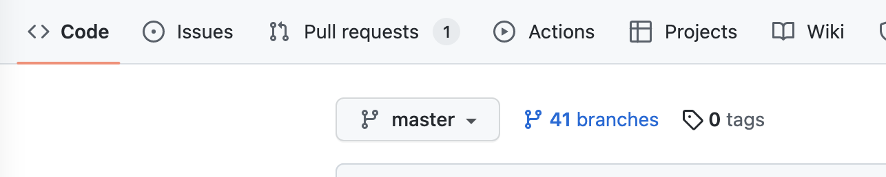
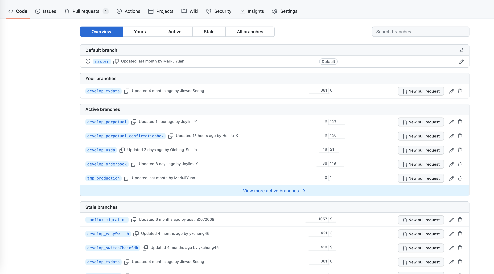
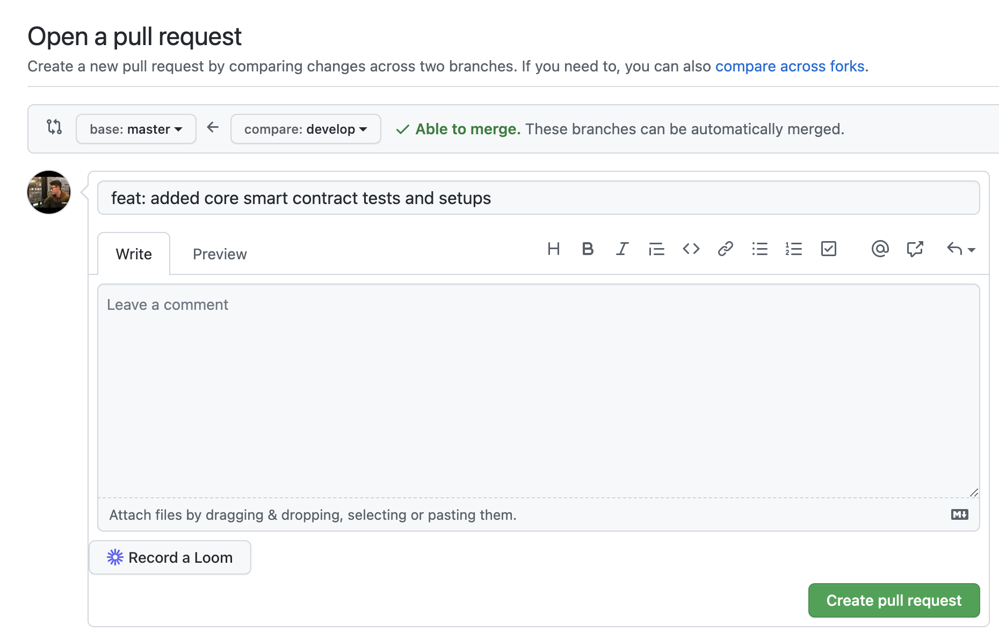
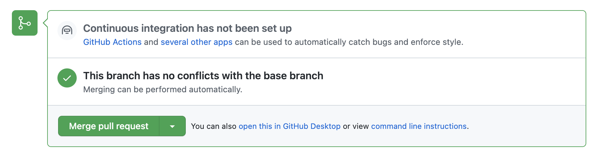
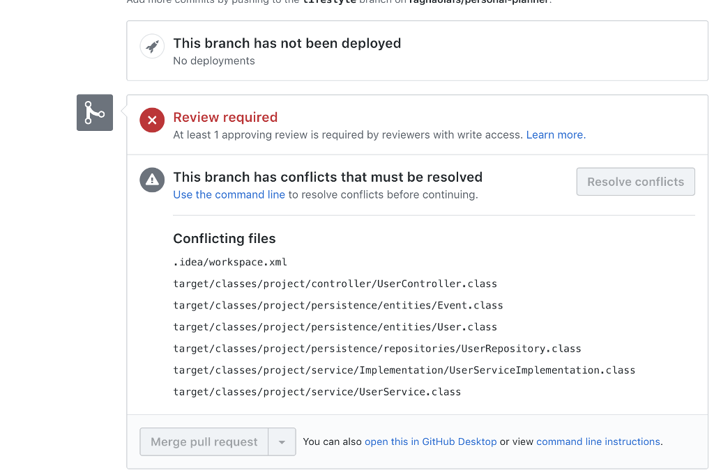

# DParty DAO Code of Conduct


# **Coding Rules**

To ensure consistency throughout the source code, keep these rules in mind as you are working:

- All features or bug fixes **must be tested** by one or more specs (unit-tests).
- All public API methods **must be documented**.


# **Commit Message Format**

*This specification is inspired by and supersedes the [AngularJS commit message format](https://docs.google.com/document/d/1QrDFcIiPjSLDn3EL15IJygNPiHORgU1_OOAqWjiDU5Y/edit#).*

We have very precise rules over how our Git commit messages must be formatted. This format leads to **easier to read commit history**.

### **Commit Message**

```jsx
<type>(<scope>): <short summary>
  │       │             │
  │       │             └─⫸ Summary in present tense. Not capitalized. No period at the end. Link with issue number if presented.
  │       │
  │       └─⫸ Commit Scope: Your Branch Name
  │
  └─⫸ Commit Type: build|ci|docs|feat|fix|perf|refactor|test
```

The `<type>` and `<summary>` fields are mandatory, the `(<scope>)` field is optional.

`<summary>` should be at most 20 words.

### **Type**

Must be one of the following:

- **build**: Changes that affect the build system or external dependencies (example scopes: gulp, broccoli, npm)
- **ci**: Changes to our CI configuration files and scripts (examples: CircleCi, SauceLabs)
- **docs**: Documentation only changes
- **feat**: A new feature
- **fix**: A bug fix
- **perf**: A code change that improves performance
- **refactor**: A code change that neither fixes a bug nor adds a feature
- **test**: Adding missing tests or correcting existing tests
- **merge**: Merge from Branch A to Branch B

### Example

Let’s say I have added a component in my frontend branch `develop_perpetual`:

```go
git commit -m "feat(develop_perpetual): added frontend price chart component for perpetual page"
```


# Branch Management



- **master**: Only Owner of the repo has the authority to merge to Master. Merged when a major milestone or product milestone is finished.
- **develop**: Main Develop Branch, anything being developped should be merged to this branch first for testing, then Only if its working, then will be merged to `release` branch. All the Unit tests, linting etc will be done here.
  - **develop/feature**: feature branch for development, should be merged to `develop` branch when finished
  - **develop/feature/subfeature**: sub feature branch of a feature branch. should be merged back to `develop/feature` branch when finished.
- **release**: This is the branch for deployment on the servers, All the CI/CD wil be ran on here.
- **hotfix**: happens rarely, its when there is a major problem in `master` that needed to be fixed.


# Merge && Code Review

1. Assume you are on a `develop/your feature name` branch, now you want to merge to `develop` branch
2. Commit your work following the above Commit Message Format.
3. Push your work`git push origin develop/your feature name` branch.
4. Click on Branches button on your Github repo.
   

5. You will be on this page, fine your branch, and click on `New pull request` button on the right of your branch
   

6. Select your Source Branch and Target Branch. Check if your commit message is correct. If everything is fine, then click `Create pull request`.
   

7. If there is no merge conflict, then the screen should look like below: 

   
   If there is merge conflict, then the screen should look like below:

   

8. **Once there is no problem with the merge, Inform Your Reviewer to review your Pull Request, then the reviewer will approve the merge.**